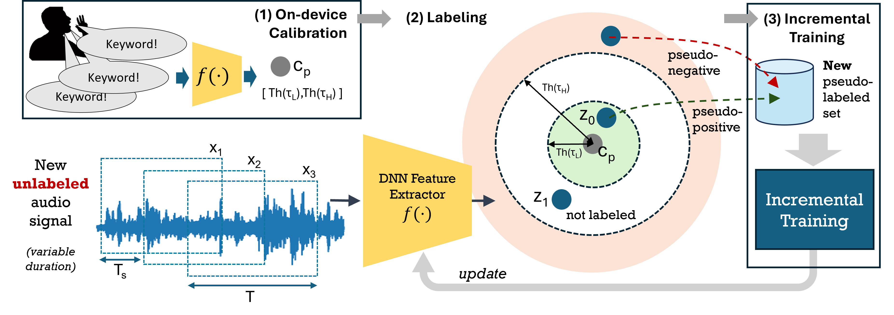

# On-Device Learning Keyword Spotting (KWS)

This repository includes the experiment code to design and test lightweight keyword spotting models that can learn new keywords over time after deployment on resource-constrained embedded systems, e.g., low-power microcontrollers.

The on-device learning approaches are described in the following papers:

## Few-Shot Open-Set Learning KWS

```
@inproceedings{rusci_interspeech23,
  author={Rusci, Manuele and Tuytelaars, Tinne},
  title={Few-Shot Open-Set Learning for On-Device Customization of KeyWord Spotting Systems},
  year=2023,
  booktitle={Proc. Interspeech},
}
```
```
@article{rusci2023device,
  title={On-device customization of tiny deep learning models for keyword spotting with few examples},
  author={Rusci, Manuele and Tuytelaars, Tinne},
  journal={IEEE Micro},
  year={2023},
  publisher={IEEE}
}
```
These two works focus the problem of on-device customization of KWS model to learn new keywords after deployment, i.e., keywords not known at training time.
The first [paper](https://www.isca-archive.org/interspeech_2023/rusci23_interspeech.pdf) describes a framework to evaluate KWS models that can learn new keywords by recording few utterance examples.
The second [paper](https://ieeexplore.ieee.org/stamp/stamp.jsp?tp=&arnumber=10241972) illustrates a microcontroller-based system solution for KWS few-shot learning. 

The repository includes the training and test scripts for a KWS audio encoder that can be initialized on-device to recongnize new keywords. 
The official branch of the INTERSPEECH paper is tagged `interspeech23`.
More details on how to setup the code can be found [here](FewShotKWS.md)

## Self-Learning for Personalized KWS
```
@article{rusci2024self,
  title={Self-Learning for Personalized Keyword Spotting on Ultra-Low-Power Audio Sensors},
  author={Rusci, Manuele and Paci, Francesco and Fariselli, Marco and Flamand, Eric and Tuytelaars, Tinne},
  journal={arXiv preprint arXiv:2408.12481},
  year={2024}
}
```
This [work](https://arxiv.org/pdf/2408.12481) describes a method to incrementally fine-tune a KWS model after few-shot initialization. The principle is llustrated in the figure below. After a calibration with respect to the few-shot data, a labeling task assigns pseudo-labels to new unsupervised data based on the similarity with respect to the prototype. The collected pseudo-labeled data are used for the fine-tuning of the model. 



### Reproducing paper results with Public Data 


The `self_learning_personalized_kws.py` in the `KWSFSL/` folder contains the code of the proposed solution. 
As an example, you can run: 
```
python KWSFSL/self_learning_personalized_kws.py --model_path <pretrained_model_path> --dataset <dataset_name> --pos_selflearn_thr 0.3 --neg_selflearn_thr 0.9 --adapt_set_ratio 0.7 --step_size_ratio 0.125 --train.epochs 20 --train.triplet_type anchor_triplet --data_dir_pos <dataset_pos_path> --data_dir_neg <dataset_neg_path> --log.dirname <dir_name> --log.results_json <json_file_name>
```

* `<dataset_name>`: two options available: `heysnapdragon` or `heysnips`. The datasets can be found at the following links: [HeySnips](https://github.com/sonos/keyword-spotting-research-datasets/tree/master) and [HeySnapdragon](https://developer.qualcomm.com/project/keyword-speech-dataset).
* `pos_selflearn_thr` and `neg_selflearn_thr` are respectively the positive and negative thresholds. 
* `<dataset_pos_path>`: path to the HeySnips or HeySnapdragon data. 
* `<dataset_neg_path>`: path to the negative data. In our experiment, we always use the HeySnips negative data. If not defined, the  <dataset_neg_path> = <dataset_pos_path>.
* `<pretrained_model_path>`: path to the .pt model to be incrementally fine-tuned. The repository include several pretrained models used for the experiments in the `pretrained_models/` folder: DSCNNS, DSCNNM, DSCNNL, RESNET15. As an example, use pretrained_models/RESNET15.pt for the path. 
* `<dir_name>` and `<json_file_name>` specify where to store the output data, e.g.: --log.dirname logs/public --log.results_json heysnips.json

To parse the output file you can use the script (adjust the dataset name and match the log output name with respect to what you used):
```
python scripts/SelfLearningLogAnalysis.py --dataset heysnips --log_name logs/public/heysnips.json
```
For the setting used in the paper (Tab. III), you can refer to the script `scripts/run_self_learning_public.sh`.

The code has been tested with the following package version:
- torch                1.12.1 
- torchaudio           0.12.1 
- librosa              0.9.2 
- numpy                1.21.6 
- scikit-learn         1.0.2 
- scipy                1.7.3 


### Reproducing paper results with Collected Data
TODO. It will be updated after public data release. 


## License
The code is distributed under MIT license. 
Part of the code is however inspired or taken by other repositories as carefully detailed in notice.txt.  


## Acknownoledge
This work is supported by the Horizon Europe program under the Marie-Curie Post-Doctoral Fellowship Program: project SEA2Learn (grant agreement 101067475).